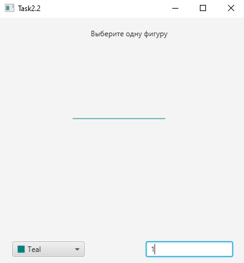
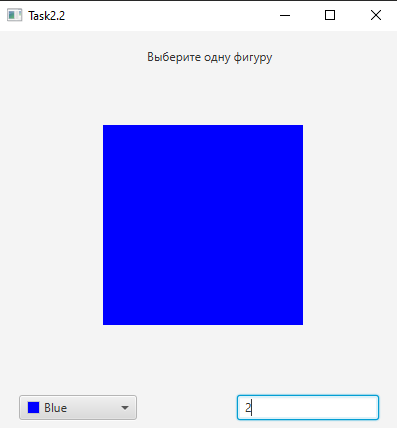
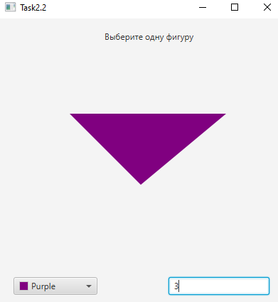
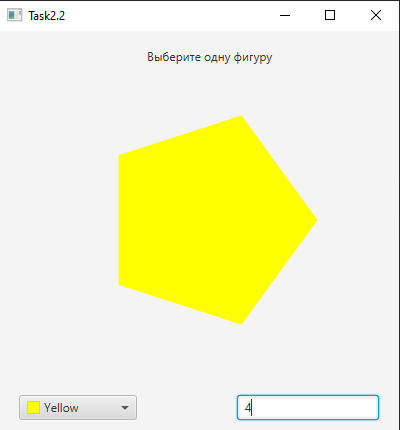

# ПРАКТИЧЕСКАЯ РАБОТА №2.2
Вывод линии  

Вывод квадрата  

Вывод треугольника  

Вывод пятиугольника  

## За основу практической работы была взята программа "Task2.2", были реализованы:
- Фабричный метод при помощи которго можно выбрать какую фигуру нарисовать
- Выбор цвета фигуры через ColorPicer 
